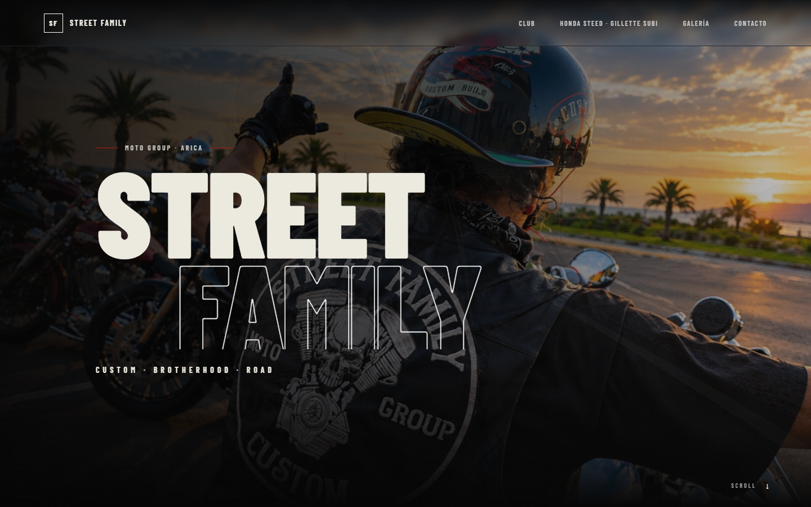
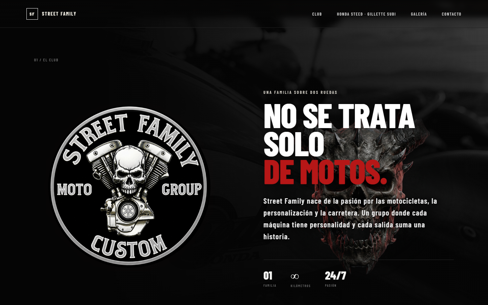
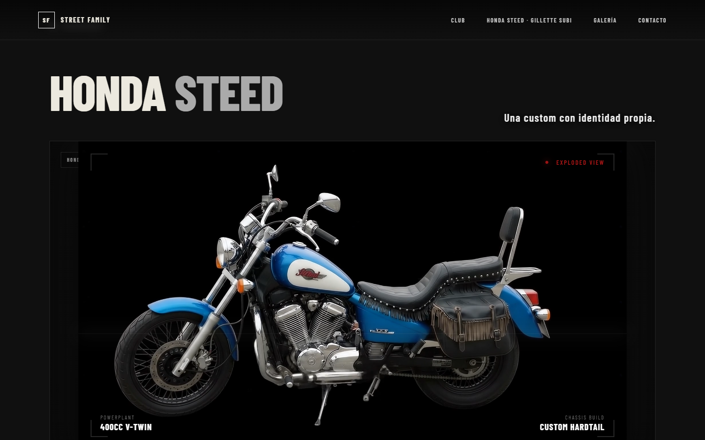
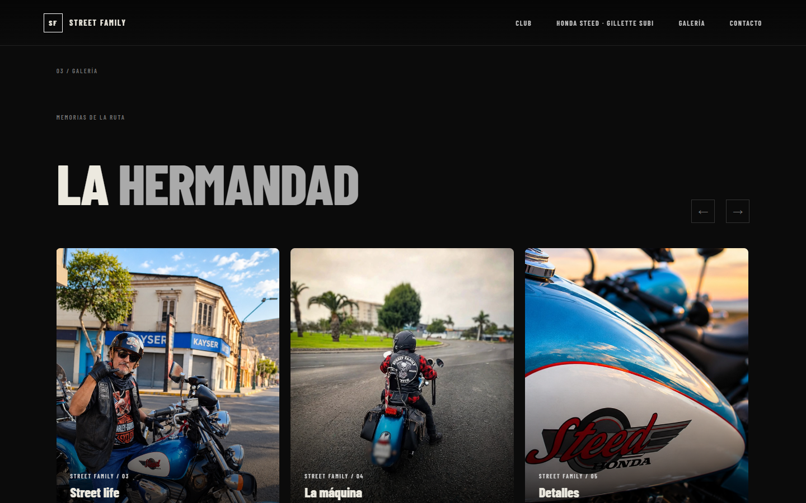
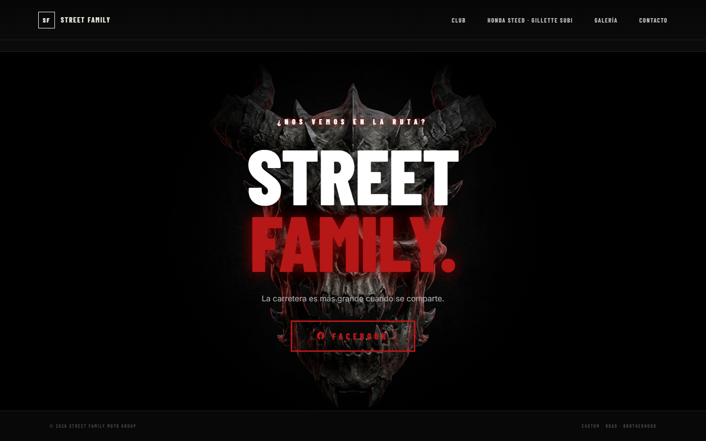

# Street Family Moto Group — React + Vite

🌍 **[Visitar el Sitio Web en Vivo (street-family.vercel.app)](https://street-family.vercel.app)**


## Vistas del Sitio

<details open>
<summary><b>Ver Capturas</b></summary>
<br>





</details>

Landing page del club Street Family, con estética custom/biker y foco en la Honda Steed "Gillette Subi".

## Incluye
- Hero cinematográfico con parallax.
- Sección del club.
- Sección interactiva de la Honda Steed / Gillette Subi.
- Animación basada directamente en el video de referencia: completa → desarme → vista explotada → armado.
- Control por botones y slider de tiempo.
- Video WebM con transparencia (fondo verde eliminado) para integrarlo sobre el diseño oscuro.
- Galería con carrusel.
- Diseño responsive.

## Ejecutar

```bash
npm install
npm run dev
```

Luego abre la URL que indique Vite, normalmente `http://localhost:5173`.

## Nota
La animación usa el video de referencia como una secuencia temporal. El punto de máxima vista explotada está alrededor de 5,2 segundos; la moto vuelve a quedar completa al final del video.
